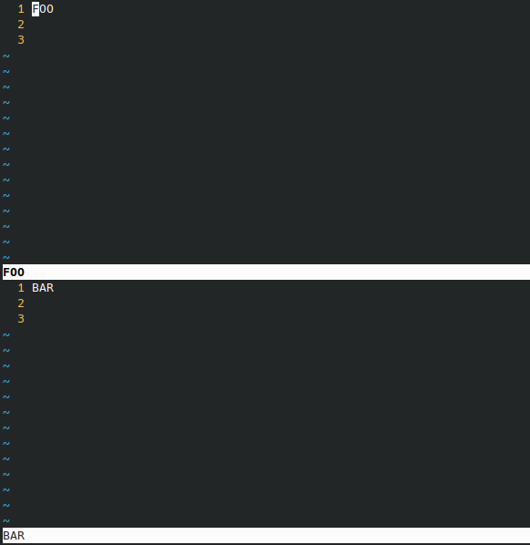

# neovim-title-inserter

With this Lua code, when first opening a file like in `nvim -o FOO BAR` , these files will open with their name written in the first line and with some blank lines below:

The opened files will be automatically written to the filesystem. You can remove then with `:!rm FOO BAR` or something.

## Installation

Just copy the code to your `init.vim` or `init.lua` config file. If you're using the first option, remember to enclose the Lua code around Vimscript `lua-heredoc` syntax:

    lua << EOF
        " put code here
    EOF
  
